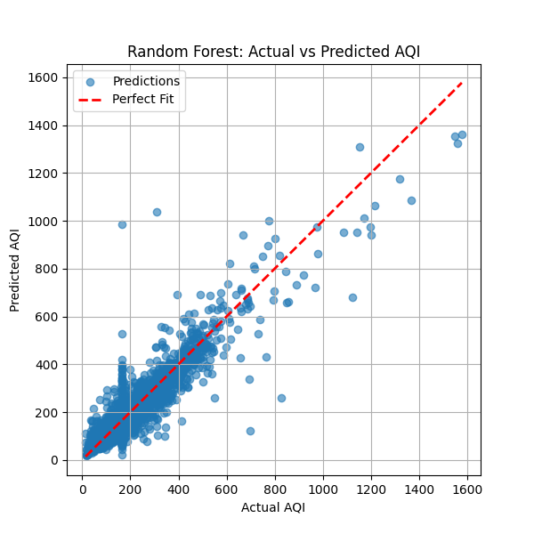

# 🌍 Air Quality Prediction using Machine Learning (Week 1 - GreenAISkills Internship)

## 📌 Project Overview
This project is part of the **AI/ML for Environmental Monitoring & Pollution Control** track under the GreenAISkills Internship.  
The goal of this project is to **predict Air Quality Index (AQI)** based on pollutant levels using Machine Learning models.

## 🎯 Objective
- Collect and clean an **Air Quality dataset**
- Train ML models to predict **AQI**
- Compare performance of **Linear Regression vs Random Forest**
- Analyze which pollutants contribute most to AQI

## 📂 Dataset
- **Name:** Indian City Day-wise Air Quality Data  
- **File used:** `air_quality.csv`  
- **Features:** PM2.5, PM10, NO2, SO2, CO, O3  
- **Target:** AQI (Air Quality Index)  

## 🧑‍💻 Methodology
1. **Data Preprocessing**
   - Handle missing values (mean imputation)
   - Select important features
2. **Model Training**
   - Linear Regression (baseline model)
   - Random Forest Regressor (ensemble model)
3. **Evaluation**
   - Metrics: Mean Squared Error (MSE), R² Score
   - Feature importance analysis
   - Visualization: Actual vs Predicted AQI plot

## 📊 Results
- **Linear Regression:**  
  - MSE = 2939.41  
  - R² = 0.805  

- **Random Forest:**  
  - MSE = 1724.38  
  - R² = 0.886 ✅ (Best Model)

- **Feature Importance (Random Forest):**  
  - PM2.5 → 0.490  
  - CO → 0.385  
  - Others (PM10, NO2, SO2, O3) → smaller influence  

## 📈 Visualization
Random Forest performed the best. The scatter plot below shows predicted AQI vs actual AQI:  

  
*Blue dots = predictions, Red line = perfect fit.*  

## 🚀 Conclusion
- Random Forest is the best model for AQI prediction in this dataset.  
- PM2.5 and CO are the most important pollutants for determining AQI.  
- This baseline project lays the foundation for building an **AI-powered environmental monitoring system**.  

---
